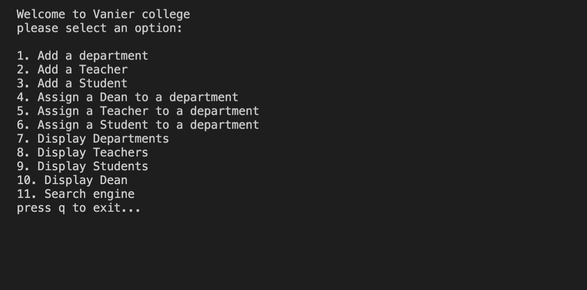
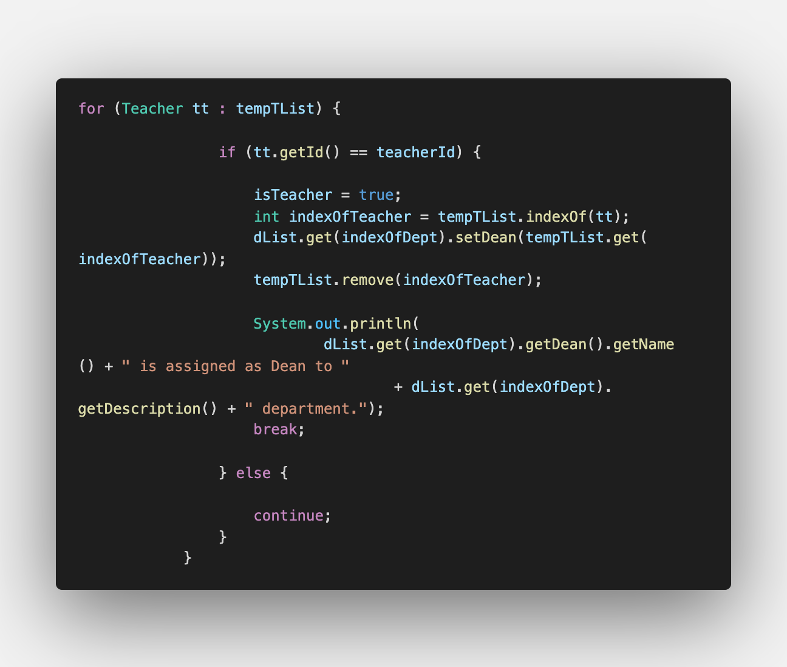
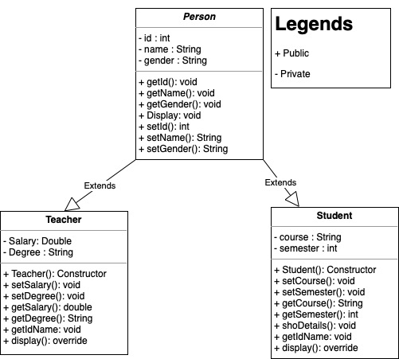
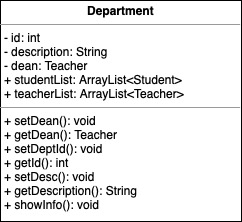

# Department-System
 Department System Program code

*****************************
Project By: Jeffrey Grospe
*****************************

- [Department-System](#department-system)
- [Concept](#concept)
- [UML DESIGN](#uml-design)
  - [Person, Teacher and Student Class](#person-teacher-and-student-class)
  - [Department Class](#department-class)
- [Summary of the Features](#summary-of-the-features)
  - [add department](#add-department)
  - [Add a Teacher](#add-a-teacher)
  - [Add a Student](#add-a-student)
  - [Assign a Dean](#assign-a-dean)
  - [Assign a Teacher](#assign-a-teacher)
  - [Assign a Student](#assign-a-student)
  - [Display Department](#display-department)
  - [Display Teachers](#display-teachers)
  - [Display Department](#display-department-1)
  - [Display Dean](#display-dean)
  - [Search engine](#search-engine)
  - [Press q](#press-q)
- [Run my code](#run-my-code)
- [Found a Bug?](#found-a-bug)


Features:
1. Add a department.
2. Add a Teacher.
3. Add a Student.
4. Assign a Dean to a department.
5. Assign a Teacher to a department.
6. Assign a Student to a department.
7. Display Departments.
8. Display Teachers.
9.  Display Students.
10. Display Dean.
11. Search Engine.

--------------------------------------
# Concept

A program design to add any number of Departments, Teachers and Students. A Teacher can be assigned to any department as a Dean. A department can have any number of Teachers and Students. However, there can only be one Dean in each department. Additionally, a Teacher that is assigned to be a dean can no longer be a teacher. Students can be assigned to multiple departments. We are borrowing the concept of a database where we can only input a unique key. This program offers multiple ways to retrieve any data.

*The following documentation will show you the behind the curtain of this program*

We create a `Person class` as our based model. Our teacher and Student class will inherit from the Person class. We are not going to instantiate any object of the Person class so we make it an abstract.

A `Teacher class` stores information about a Teacher. Other than the instance variables that it inherits from the `Person class`, it has its own instance variables namely; `salary` and `degree`. There are also additional methods in this class. You can check these in the UML diagram section.

A `Student class` stores information about a Student. Similar to the Teacher class, it has its own instance variables namely; `course` and `semester`. Check the UML diagram section.

A `department class` stores information about a department. It has `department ID` and `department description` instance variables. Additionally in the department class we are going to use **ArrayList**. a `TeacherList` Teacher type and `StudentList` a Student type. We need this so we can store teachers and students into a specific instance of the Department. This class does not extend to the `Person class` because there is no connection between the two.

The `Main class` is where all the magic happens. The program runs by a simple while loop. It will continue to run until the user decides to quit.
```Java
do {
            pickANum(InputMenu(), dd, deptList, newTeacher, newStudent, tempTeachList, tempStudentList, tempDeptList,
                    copySList, copyTList);
        } while (activeFlag);
```
`InputMenu()` is a method to show the menu for the user to choose from. It asks an input to the user and returns the collected data as a *String*.


*"Why is it a String and not an int you say? The simple answer is; I want the user to simply press 'q' to exit the program. For sure I could have used the try-catch method but I do not want to make this more complicated"*

We will pass this information as an argument to `pickANum()` method. This is where our switch case resides and this is where the complexity of this program is coming from.

*It is important to know how local scope and global scope work. Since our ArrayList and objects only exist inside the static main method which makes it local variables, we have to pass these variables as arguments for our method pickANum().*

*"Don't get intimated by the hundred lines of code within the switch statement. Not the prettiest code but you can refactor it easily! You are in charge! I believe in you!*


Each cases correspond to different actions.
The first **CASE** is where we add a department object or where we make an instance of the department class. This method asks for department ID and department description. We then add this department into an ArrayList of a department type.


*Another feature I implement is the **Unique Constraint**. Similar to how a  primary key works in SQL, PKs should be unique. The way I do this is by creating a Static ArrayList of Integer where I store all the entered ID numbers. Instead of using Enhanced for loops, I simply use
```java
if (pkDept.contains(deptId)) {
  // print out an error! duplicate keys! Ew!
} else {
  // Key is unique, Go ahead soldier!
}
```
`if (pkDept.contains(deptId)` = this will check the ArrayList, if the entered ID number already exists, it prints out an error message and it returns to the main menu options otherwise the program will continue. By doing this I save myself from a few lines of code *cough *cough.


**How do I add the objects?**
```java
 dList.add(new Department(deptId, deptName));
                tempD.add(new Department(deptId, deptName));
                pkDept.add(deptId);
```
As you can see here we are also adding it to a temporary list. The reason behind this is that we are going to manipulate the temporary list only. Later in the program, we want to show the complete and unaltered list of departments and that is when this will come in handy.

The method we use here is similar to **adding a Teacher** and **adding a Student**. Of course, a teacher and student will ask different properties. 

*I use an awful amount of enhanced for loop, my suggestion is to create a method for it so you do not have to hard code every single time.*

Now let us talk about adding a dean to a department.
First step, I verify if the user entered ID of a Teacher already exist if it does, I will inform the user and I will ask to re-enter a Teacher ID. Moreover, if there are no departments I will ask the user to add at least one. The way I do this is to check if the ArrayList is empty or not. For instance, `if(tempTList.isEmpty(){//warning msg}else{//do this}`. The second verification is to confirm that the entered ID exist in our data. We verify it by using an enhance for loops and conditional statements. Once It passes all the verification, we display all the available Teachers and Departments. We then ask the user to enter the department ID and the Teacher ID that will be added as a dean.


*How do I add a Dean you say*?




I know there is a lot of stuff going on here but we will go step by step.
We enter this loop after we verify that the entered department ID exists. Additionally when the department verification is successfully we store the index number of that department hence `indexOfDept`. This allows us to set the Dean to the correct department. `dList.get(indexOfDept).setDean(tempTList.get(indexOfTeacher))` We also store the verified Teacher index to `indexOfTeacher`. The `setDean()` is a department method. *Dean is a teacher object*. `tempList.remove(indexOfTeacher)` removes that object from the temporary list so it will not show up in the available teachers. 

*Why I choose the enhanced for loop over the regular for loop?*
The reason is because of simplicity. You can do it in a regular for loops but I find enhanced for loop a lot easier to manage.

*What is `isTeacher = true;`?
This is a boolean condition that helps the program to determine if the entered Teacher ID exists. As you can see here, once the entered ID matches the one It has in the ArrayList it will set it to true. Outside this for loop we can find  a statement `if(!isTeacher){"Invalid Teacher ID"}` *!isTeacher* means if its false. Then this code will run. Keep in mind that the initial value of this boolean condition is set to false. Therefore, it will only run if there is no match found.

*You will encounter this algorithm again so it is good to know what it does.*

The cases from 4 to 6 follow the similar data structure.


The cases from  7 to 10 have verification statements and enhance for loops to display the stored data.

The case 11 is a search engine. The user can enter any department number and it will retrieve any information stored to that department.
This is a simple structure, we already how the verification works, how we retrieve data and how we use a boolean condition to display an invalid input. Case 11 is combination of all of these.

The last Case statement is where we terminate the program. It sets the activeFlag to false causing the while loop to stop.

# UML DESIGN

## Person, Teacher and Student Class





## Department Class



# Summary of the Features

## add department
- It creates an instance of department
- It adds this instance into two ArrayList, a initial and a temporary list

## Add a Teacher
- It creates an instance of Teacher
- It adds this instance into two ArrayList, a initial and a temporary list

## Add a Student
- It creates an instance of Student
- It adds this instance into two ArrayList, a initial and a temporary list

## Assign a Dean
-  It asks for a specific department and Teacher
-  It sets that Teacher as a dean
-  It removes it from the Temp ArrayList 

## Assign a Teacher
-  It asks for a specific Teacher and Department
-  It adds that Teacher to that Department

## Assign a Student
-  It asks for a specific Student and Department
-  It adds that Student to that Department

## Display Department
-  It display all the Departments
-  It uses the initial ArrayList

## Display Teachers
-  It display all the Teachers
-  It uses the initial ArrayList

## Display Department
-  It display all the Students.
-  It uses the initial ArrayList.

## Display Dean
-  It display all Deans.
-  It loops through inside the initial department list.

## Search engine
-  It asks for a specific department and retrieves all its information.
## Press q
- It terminates the program.

# Run my code
In your browser simply press ".". This will open up vscode in browser mode. Feel free to try it out.

# Found a Bug?
-  If you found a bug! please let me know and i will squash it!.